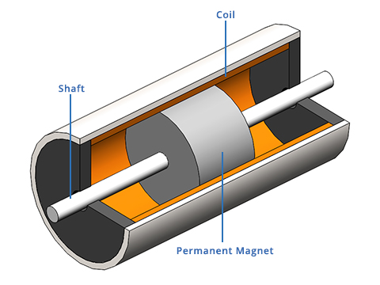
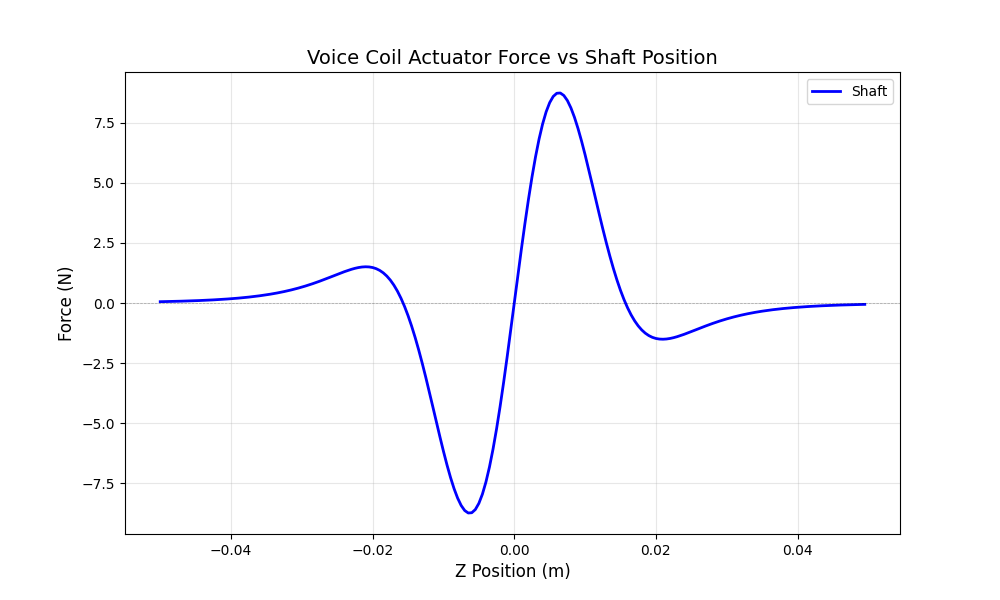

# Overview


> [!WARNING]
> Do not assume the resulting design variables are suitable for fabrication or real-world use without further analysis.

A `voice-coil` actuator is an electromechanical device that produces linear motion using an inner permanent magnet (pole) on a shaft and an outer coil to produce force via `co-energy` between the field sources.

<div align="center">
  
  <p><em>Figure 1: Quarter-sectional view of the voice-coil actuator topology showing the permanent magnet (pole) and coil.</em></p>
</div>

## Mathematical Implementation

The model is constructed using axial-symmetric coordinates due to the axial symmetry of a voice coil. The model also assumes the domain has a relative permeability of $\mu_r = 1$. This assumption allows the model to use a simplified superposition model to calculate the co-energy and then virtual work. The specific model for virtual work is shown here:

$$ U = A_{\text{rad}} \cdot \mu_0 \cdot \int_{\Omega} \left( H_{\text{pole}}(z-z_{t}) \cdot H_{\text{coil}}(z) \right) \, dz $$

$$ F = -\frac{dU}{dz} \approx -\frac{U(z+\Delta z) - U(z-\Delta z)}{2\Delta z}$$

The field strength formulas for the pole and coil are:

$$
h_{\text{pole}}(z, m) = h_{\text{peak}} \left[ \mathrm{sech}\left( \frac{n\left((z-m)+\frac{l}{2}\right)}{l} \right)^2 - \mathrm{sech}\left( \frac{n\left((z-m)-\frac{l}{2}\right)}{l} \right)^2 \right]
$$

The coil formula is more complex, as it involves first calculating the number of turns via `fill factor` and then modelling the field based on current and geometry:

$$
h_{\text{coil}}(z) = \frac{N I}{2\pi \ell} \left[
\frac{z + \ell/2}{\sqrt{(z + \ell/2)^2 + R^2}} - 
\frac{z - \ell/2}{\sqrt{(z - \ell/2)^2 + R^2}}
\right]
$$

## Computational Implementation

The model was constructed using `picounits` and implements the virtual work method using the limit of the field in $(-z, z)$:

$$ U = A_{\text{rad}} \cdot \mu_0 \cdot \lim_{N \to \infty} \sum_{i=1}^{N} \left( H_{\text{coil}}(z-z_{t}) \cdot H_{\text{pole}}(z) \right) \, dz $$

$$ \Omega = \{ z \mid |H_{\text{coil}}(z)| > \varepsilon \quad \text{or} \quad |H_{\text{pole}}(z)| > \varepsilon \}$$

The $A_{\text{rad}}$ is the effective area the magnetic field strength is passing through. The parameter file for the simulation can be found [here](./00_simulation/parameters.uiv).

<div align="center">
  
  <p><em>Figure 2: Simulated force vs. position for a single voice-coil actuator.</em></p>
</div>

## Installation

To run the analytical model, the following packages are required:

```bash
pip install picounits matplotlib
```